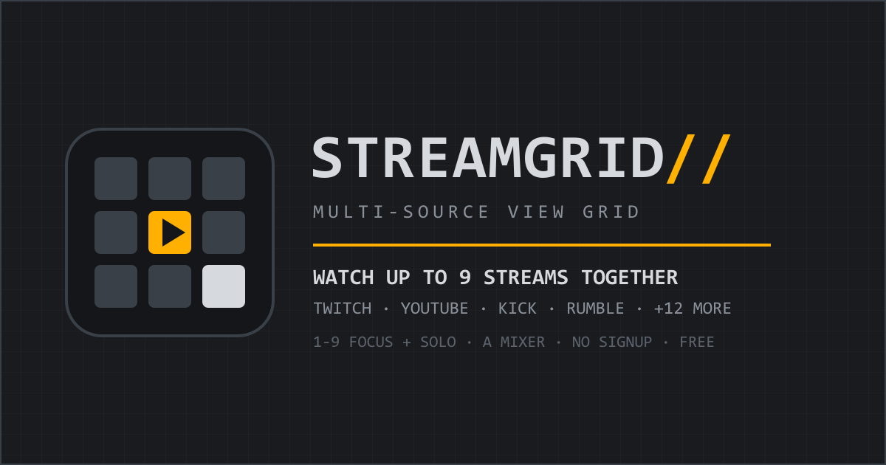

# StreamGrid

Watch up to 9 live streams together in a single grid — Twitch, YouTube, Kick, Rumble, and 12 more sources. Free. No sign-up.

**Live app:** https://streamgrid.adityalabs.in



## Features

- **Unified multiview grid** — paste any supported stream URL and it plays alongside the rest, up to 9 feeds.
- **Instant focus** — press `1–9` to expand any feed fullscreen. Its audio solos automatically; the other tiles keep playing, nothing reloads.
- **Per-stream audio mixer** — individual 0–100 volume for YouTube, Twitch, HLS, and MP4 feeds. One-key mute-all.
- **Keyboard-first** — the full workflow (add, focus, mix, mute, exit) never requires the mouse.
- **Private by design** — no accounts, no cookies, no analytics. Your layout is stored only in your own browser.
- **Free forever** — no tiers, no paywalled sources.

## Supported sources

| Source | URL format | Volume control |
|---|---|---|
| Twitch | Channel, VOD, clip links | Full |
| YouTube | Watch, live, Shorts, youtu.be links | Full |
| Kick | Channel, video links | Mute toggle |
| Rumble | Video, embed links | Mute toggle |
| Vimeo | Video page links | Mute toggle |
| Dailymotion | Video, dai.ly links | Mute toggle |
| Facebook | Video, reel, fb.watch links | Mute toggle |
| TikTok | Video links (VOD only — live offers no embed) | Mute toggle |
| Trovo | Channel links | Mute toggle |
| DLive | Channel links | Mute toggle |
| SOOP (AfreecaTV) | Station links | Mute toggle |
| Nimo TV | Streamer links | Mute toggle |
| Odysee | Video links | Mute toggle |
| Steam | Broadcast links | Mute toggle |
| HLS | Direct `.m3u8` playlists | Full |
| MP4 / WebM | Direct file links | Full |

Sources without a volume API are mute-toggle only. Unrecognized URLs are rejected with an explicit error — a blank tile is never added.

## Shortcuts

| Key | Action |
|---|---|
| `Enter` | Add the pasted stream |
| `1–9` | Focus a feed and solo its audio |
| `0` / `Esc` | Return to grid, restore audio state |
| `A` | Open / close the audio mixer |
| `M` | Mute all feeds |
| `?` | Open the field manual |

All feeds start muted to satisfy browser autoplay policy. Unmute by focusing a tile or via the mixer.

## Run locally

```powershell
npm install
npm run dev
```

Open http://localhost:3000. Requires Node 18+. No environment variables, no database, no API keys.

## Stack

Next.js (App Router) · React · hls.js · YouTube IFrame API · Twitch Embed API. One client component owns the grid; URL parsing and embed construction are pure functions in `lib/parseStream.js`. Production build is fully static.

## Deployment

```powershell
npm run build
npm run start
```

Ships as a static Next.js export — any static host works. Canonical deployment targets `https://streamgrid.adityalabs.in` with `sitemap.xml`, `robots.txt`, OpenGraph cards, and `WebApplication` / `FAQPage` structured data included.

## License

MIT — see [LICENSE](LICENSE) for details.
